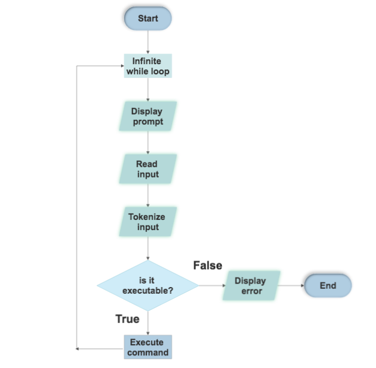

<div align="center">
  
</div>

# [Simple Shell](https://via.placeholder.com/10/00b48a?text=+)🐚

The shell is like a program that receives command inputs from the user’s keyboard and sends them to a machine to be executed by the kernel.

It also checks to see if the user’s command inputs are correct.

- Initialize: In this stage, a typical shell will read as well as execute its set of configuration files. These alter the shell’s behavior.

- Interpret: The shell then reads commands from “stdin” and executes them.

- Terminate: After the execution of its commands, the shell performs any of the shutdown commands, frees any memory, and terminates.

These stages are general and they may be applicable to a wide range of programs, but we will use them as the foundation for our shell.

Our shell will be so basic that there will be no configuration files and no shutdown command.

## [Prototype](https://via.placeholder.com/10/00b48a?text=+) 🤖

```c
int main(void);
```

## [Compilation](https://via.placeholder.com/10/00b48a?text=+)💻

```bash
gcc -Wall -Werror -Wextra -pedantic -std=gnu89 *.c -o hsh
```
### [Prerequisites](https://via.placeholder.com/10/00b48a?text=+)

Before you can run `simpleshell`, make sure you have the following:

- A Unix-like operating system (Linux, macOS, etc.)
- GCC (GNU Compiler Collection) installed for compilation.

## [Testing](https://via.placeholder.com/10/00b48a?text=+) 🔎

Our shell work like this in interactive mode:

```bash
simpleshell$ ./hsh

simpleshell$ /bin/ls
  hsh main.c shell.c

simpleshell$ exit

```
also in non-interactive mode:

```bash
simpleshell$ echo "/bin/ls" | ./hsh
hsh main.c shell.c test_ls_2
simpleshell$

simpleshell$ cat test_ls_2
/bin/ls
/bin/ls
simpleshell$

simpleshell$ cat test_ls_2 | ./hsh
hsh main.c shell.c test_ls_2
hsh main.c shell.c test_ls_2
simpleshell$
```

## [Usage/Examples](https://via.placeholder.com/10/00b48a?text=+) 🖊

```bash
SimpleShell$ ls
AUTHORS            execute.c          main.h             path.c             tokenize.c
README.md          main.c             man_1_simple_shell

simpleshell$ env
PATH=/usr/local/bin:/usr/bin:/bin
HOME=/home/user

simpleshell$ echo "Hello, World!"
Hello, World!

simpleshell$ exit
$
```

## [Flowchart](https://via.placeholder.com/10/00b48a?text=+) 📉



## [Our files](https://via.placeholder.com/10/00b48a?text=+) 📁

```
   - AUTHORS: contributors to the project
   - execute.c: execute a command
   - main.h: header file
   - path.c: functions related to path
   - tokenize.c: tokenize input
```

## [Functions we used](https://via.placeholder.com/10/00b48a?text=+) 📲

```
   - exit
   - execve
   - fork
   - free
   - getenv
   - getline
   - isatty
   - malloc
   - perror
   - printf
   - sprintf
   - stat
   - strcmp
   - strdup
   - strtok
   - wait
```

## [Conclusion](https://via.placeholder.com/10/00b48a?text=+) 💎
This is a basic Unix-like shell program called `simpleshell`. It provides a simple command-line interface for executing commands and displaying environment variables.
Building a simple shell in C involves understanding how to parse and execute commands, handle user input and output, and manage processes using system calls like fork and execve.
The process of creating a shell requires a deep understanding of C programming language and the Unix operating system.
